# FootballTicket

A full-stack ticketing platform for managing football match ticket sales with real-time seat selection functionality.

# 🛠 Built with:

- React (Frontend)
- Spring Boot (Backend)
- MySQL Database
- React Konva (Stadium Layout)
- WebSocket/STOMP protocol
- Stripe payment processing
- BCrypt encryption
- HTTP-only cookies (SameSite Lax)
- Docker
- SonarQube quality tests
- Lighthouse metrics
- CI/CD pipeline
- Email notifications

# Pages with permissions:

| **Permissions**          | Guest | User | Admin |
| ------------------------ | ----- | ---- | ----- |
| Homepage                 | ✅    | ✅   | ✅    |
| Login/Register           | ✅    | ❌   | ❌    |
| Profile Management       | ❌    | ✅   | ✅    |
| Ticket Booking           | ❌    | ✅   | ✅    |
| My Tickets               | ❌    | ✅   | ✅    |
| User Management          | ❌    | ❌   | ✅    |
| Stadium Management       | ❌    | ❌   | ✅    |
| Club Management          | ❌    | ❌   | ✅    |
| Competition Management   | ❌    | ❌   | ✅    |
| Match Management         | ❌    | ❌   | ✅    |
| Statistics               | ❌    | ❌   | ✅    |

# Pages:

**Home page**

Home page of the application. Provides navigation to different sections of the platform.
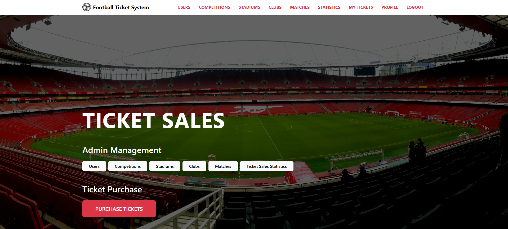

**Login page**

The page allows the users to log in to the application.
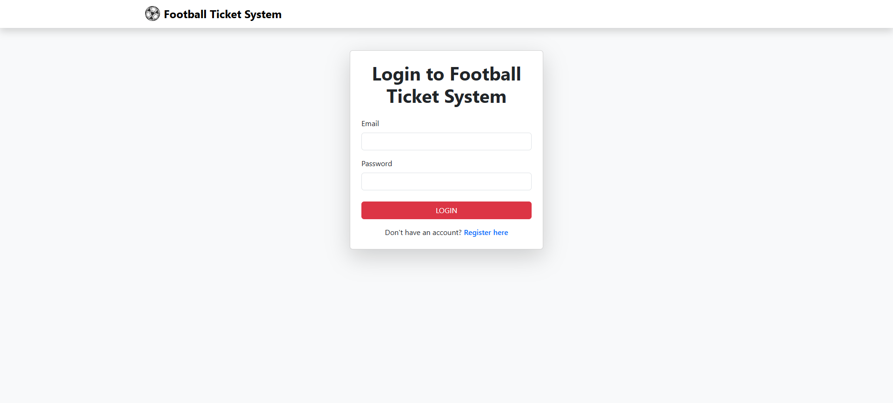

**Register page**

Allows new users to create an account on the platform.
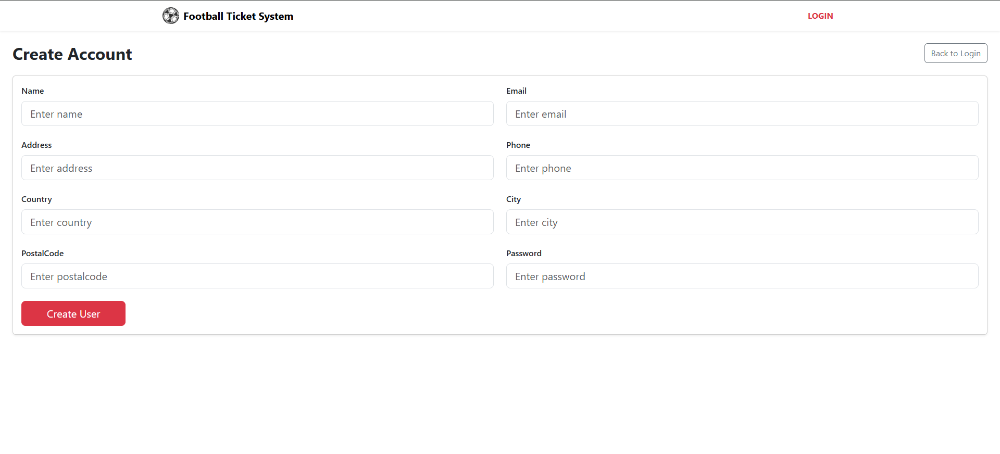

**Profile page**

On the profile page, users can view their account information.
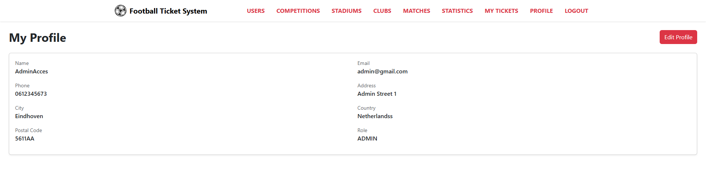

**Profile Edit page**

Users can edit their personal information on this page.
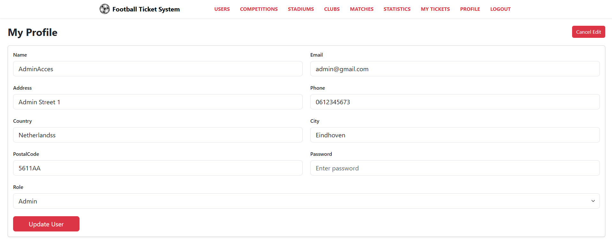

**Ticket Booking page**

Complete flow for purchasing tickets:
1. Select a match
2. Choose a stadium section/box
3. Select available seats (with real-time updates via WebSockets)
4. Complete payment through Stripe integration

The system uses WebSockets to show live seat selection to all users, with notification messages when seats are selected or deselected.
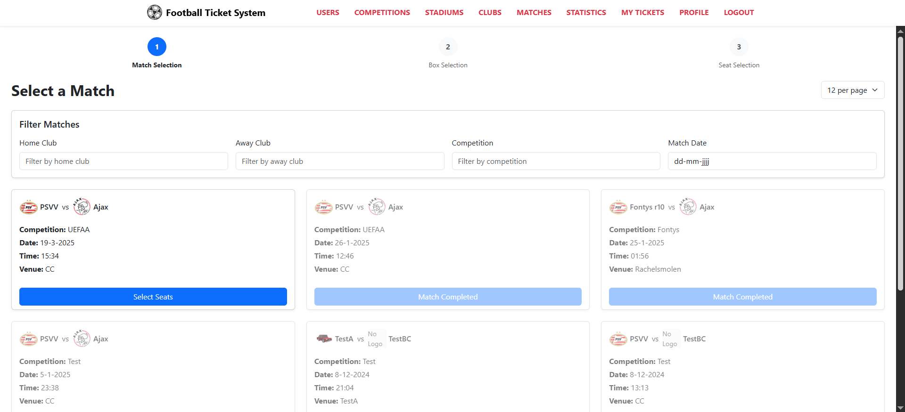

**Ticket Flow**

Real-time demonstration of the ticket booking process:
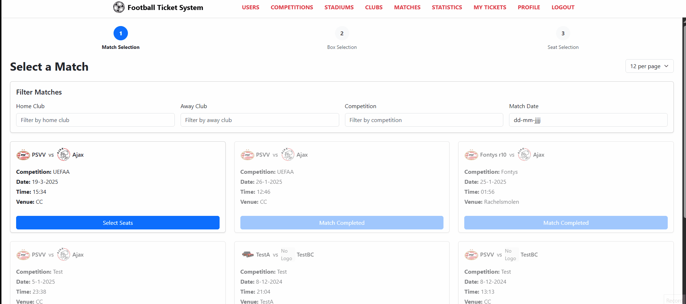

**My Tickets page**

Users can view tickets they've purchased and access all information regarding their bookings.
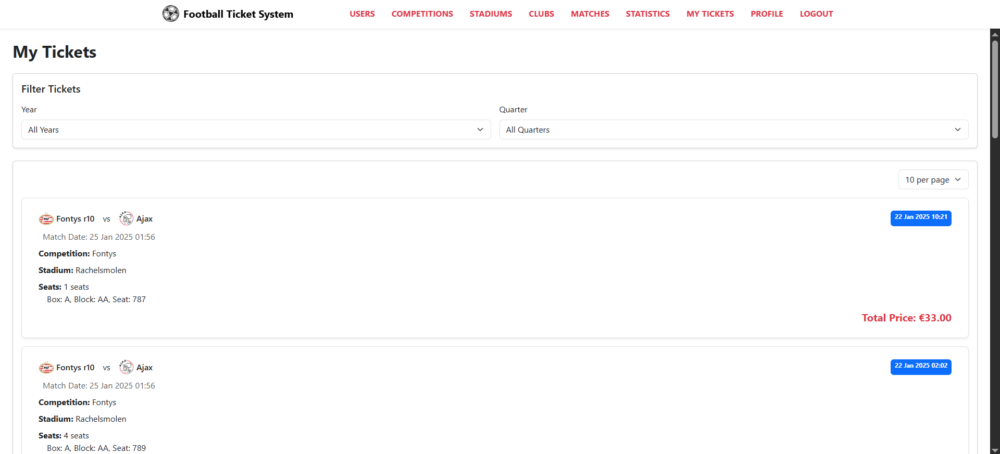

**User Management page**

Admin-only page for managing all users registered on the platform.
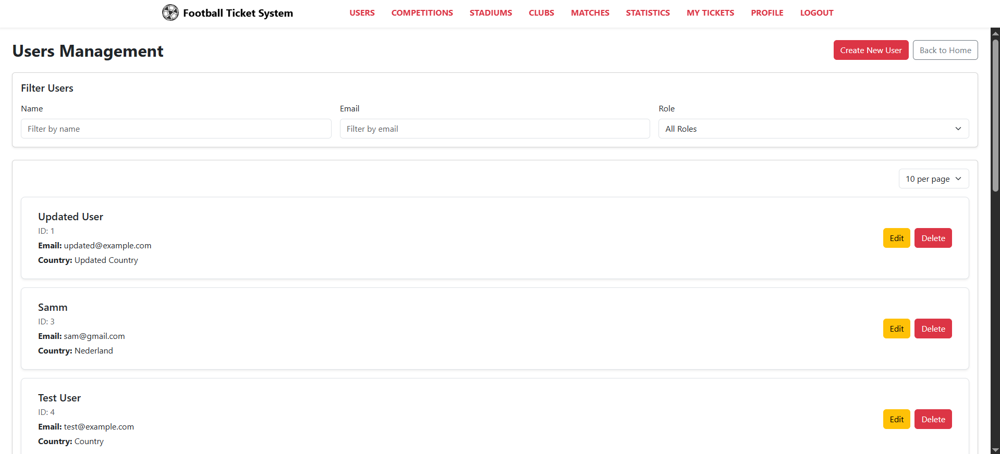

**Stadium Management page**

Admin-only page for creating and managing stadiums. Admins can design customized stadium layouts using React Konva.
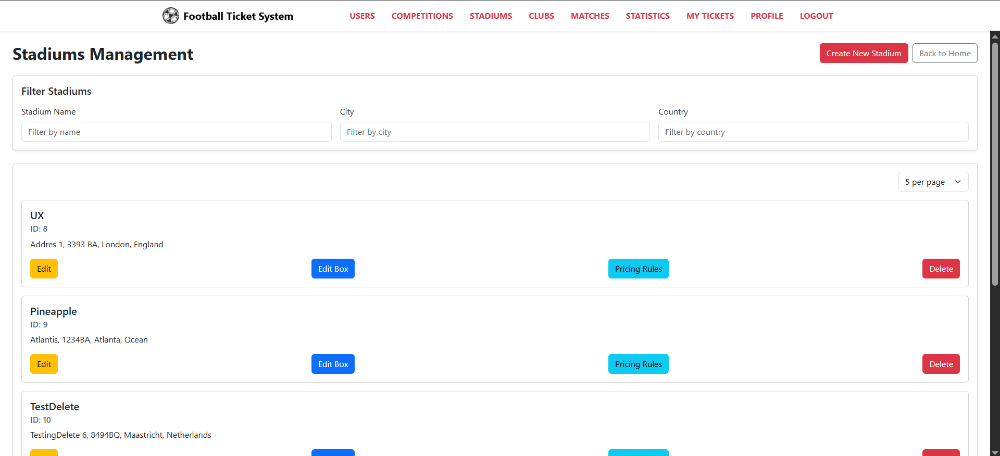

**Stadium Builder**

Interactive tool for building custom stadium layouts:
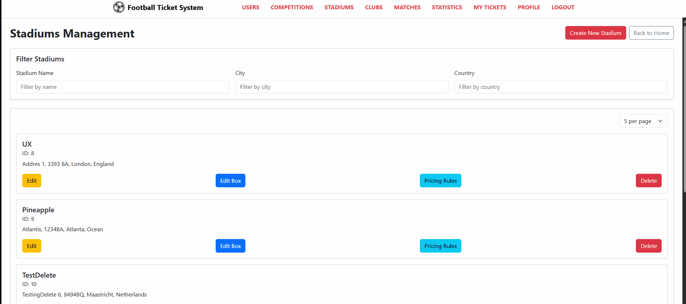

**Box Pricing Rules**

Admin interface for setting dynamic pricing rules for different stadium sections:
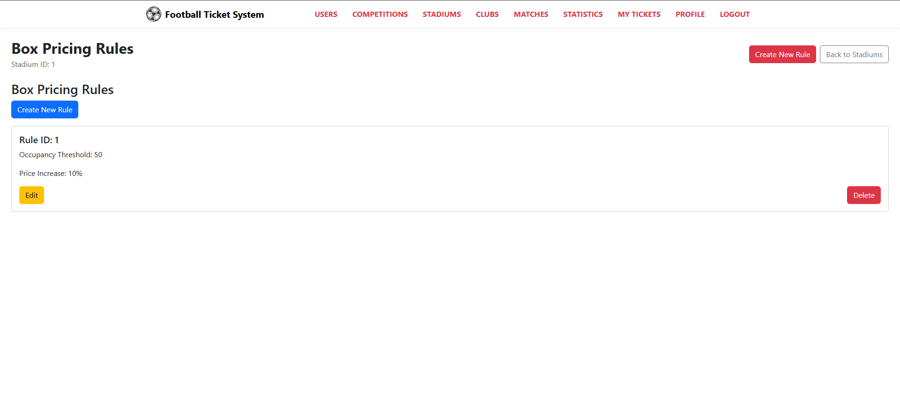

**Competition Management page**

Admin-only page for creating and managing football competitions.
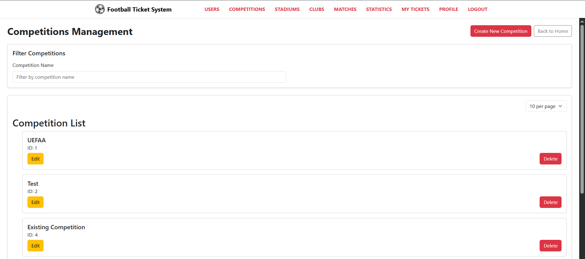

**Match Management page**

Admin-only page for scheduling and managing matches between clubs.
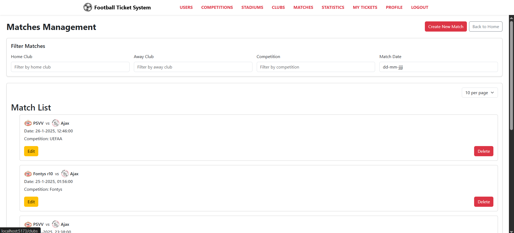

**Statistics page**

Admin-only analytics dashboard providing insights into ticket sales.
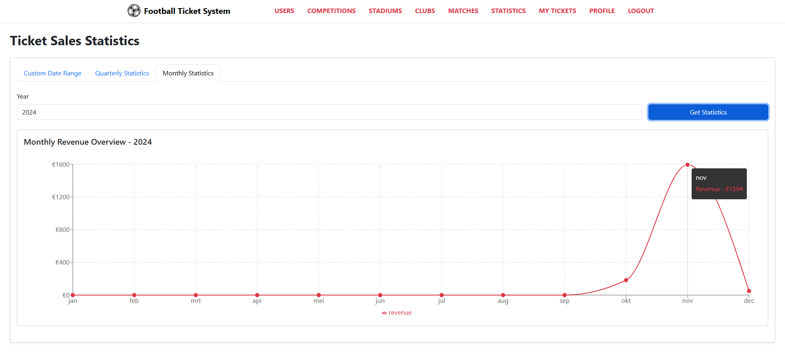

**Statistics by Quarter**

Customizable statistics view by quarters:
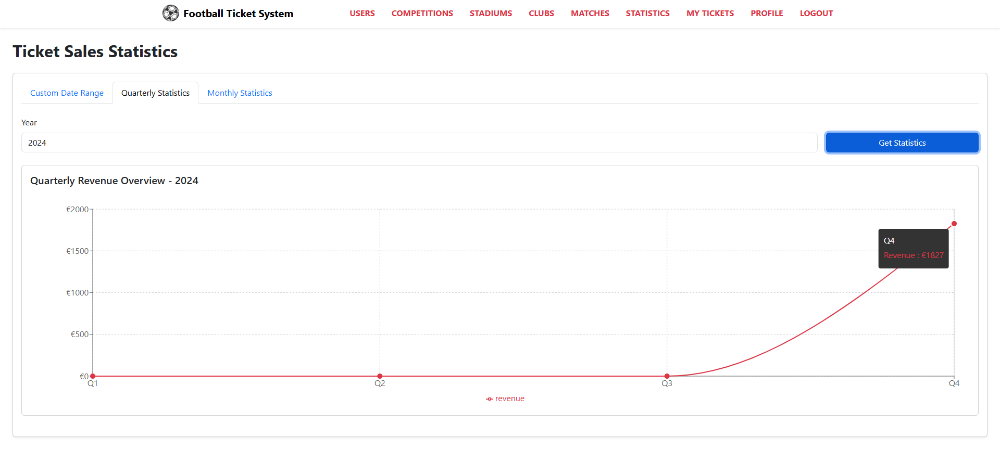

**Statistics by Date**

Customizable statistics view by date range:
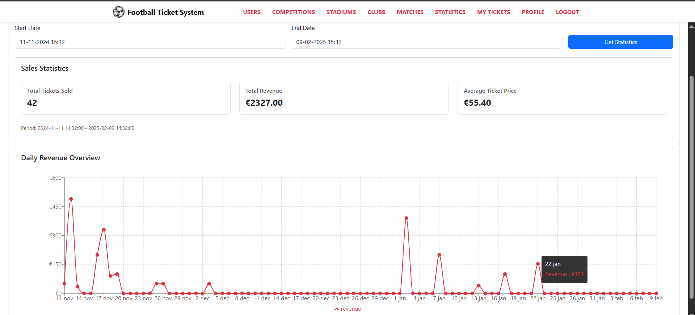

# Key Features:

- **Real-time Seat Selection**: Live updates via WebSocket/STOMP protocol
- **Secure Authentication**: HTTP-only cookies with SameSite Lax policy, BCrypt encryption, and refresh tokens
- **Dynamic Stadium Builder**: Customizable stadium layouts using React Konva
- **Automated Pricing Rules**: Configure pricing based on sections, matches, or special events
- **Payment Processing**: Seamless checkout experience with Stripe integration
- **Email Notifications**: Automated notifications for ticket purchases and updates
- **Comprehensive Test Coverage**: 86% backend test coverage
- **CI/CD Pipeline**: Automated deployment using Docker, SonarQube, and Lighthouse metrics